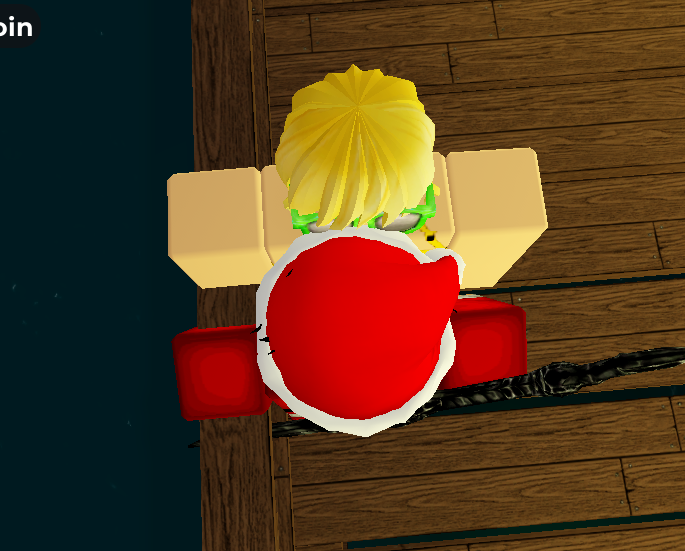
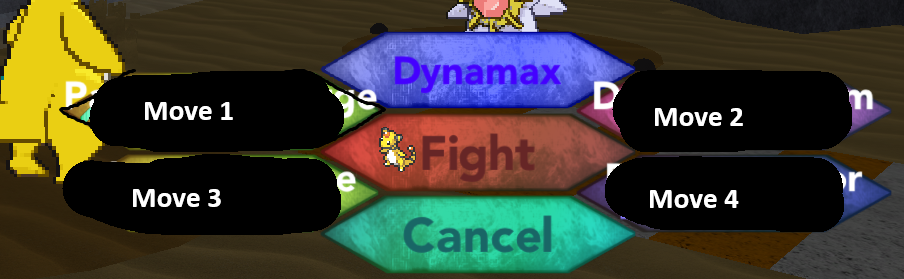

# Roblox Pokemon Brick Bronze Roria Conquest Battle Farmer (roblox_farm.py)

Windows script that automates repeatable Roblox trainer battles using fixed coordinates, colour checks, and timing delays.

---

## Requirements
- Windows 10 or Windows 11
- Python 3.10 or newer recommended
- Roblox running (RobloxPlayerBeta.exe or RobloxStudioBeta.exe)
- Roblox window must be visible and not minimized

---

## Install

1) Place roblox_farm.py in a folder.

2) Open Command Prompt in that folder.

3) Install dependencies:
```
pip install -r requirements.txt
```
---
## Run

Start Roblox first, then run:

python roblox_farm.py

---

## Usage

Go to the Rosecove City pier and find "Babe Samantha".


Stand completely face to face with her:



Then run the script.

It uses the number of PP per move to decide how many times to click each move, so set these correctly.

Use this image as a guide for how moves are laid out:



Update these values inside `roblox_farm.py`:

PP_MOVE1 = 20  
PP_MOVE2 = 10  
PP_MOVE3 = 0  
PP_MOVE4 = 5  

Setting a move PP to 0 will skip that move completely.

---

## Notes

It works best if your moves 1-shot each Pokémon.
Probably works with any trainer that you can fight again and again? Not tested though. 
If your Pokémon is about to learn a move, the script will play 2 beeps and pause. Handle the move manually, then press 0 (zero) to continue.


## Hotkeys

ESC  
Stops the script immediately.

P  
Pauses or unpauses the script.  
When unpaused, Roblox is refocused and the script continues exactly where it left off.

0  
Only used when a learn-move prompt is detected.  
Press after you manually handle the move replacement.

---

## What the script does (in order)

1) Finds the Roblox window (Player or Studio).
2) Forces the window to a fixed size and position using WIN_X, WIN_Y, WIN_W, WIN_H.
3) Repeats the following loop until stopped or PP runs out:
   - Clicks the trainer multiple times
   - Accepts the battle
   - Waits for the battle to load
   - For each opposing Pokémon:
     - Handles Yes/No prompts first if present
     - Clicks Fight only if the Fight button colour is detected
     - Clicks a move button
     - Handles switch prompts when expected
   - Spam-clicks dialogue to exit the battle

The script does NOT read HP bars, KO text, or battle messages.  
It relies entirely on fixed coordinates, colour checks, and timing delays.

---

## Moves and PP

### Move positions
MOVE1_CLICK  top-left  
MOVE2_CLICK  top-right  
MOVE3_CLICK  bottom-left  
MOVE4_CLICK  bottom-right  

### PP values
PP_MOVE1  
PP_MOVE2  
PP_MOVE3  
PP_MOVE4  

### Move selection logic
- Moves are attempted strictly in this order: Move 1 → Move 2 → Move 3 → Move 4
- Any move with PP equal to 0 is skipped
- Each time a move is used, its PP is reduced by 1
- When all PP values reach 0, the script stops

If your Pokémon only has 3 usable moves:
- Set PP_MOVE4 = 0

---

## Colour checks

The script confirms it is on the correct UI screen by sampling pixel colours.

Yes / No prompt:
- Anchor: PROMPT_NO_ANCHOR_XY
- Expected colour: #333333 (RGB 51, 51, 51)
- When visible, the script will not click Fight

Fight button:
- Anchor: FIGHT_ANCHOR_XY
- Expected colour: #662626 (RGB 102, 38, 38)
- Fight is clicked only if this colour matches and No is not visible

Learn-move screen:
- Anchor: LEARN_L_ANCHOR_XY
- Expected colour: #FFFFFF (RGB 255, 255, 255)
- Checked briefly before clicking No so the script does not skip the learn-move screen

---

## Beeps and what they mean

Learn-move detected:
- Two beeps (high tone then lower tone)
- Script pauses completely
What to do:
- Handle the move replacement manually in Roblox
- Press 0 to continue

Timeout alert:
- Two beeps separated by about one second
- Script expected a Yes/No prompt but did not confirm it in time
- The script may attempt a limited recovery by re-clicking Fight and the move

Stop or finished:
- Triple beep
- Usually means all PP are depleted or the script has stopped

---

## Adjusting for your setup

If clicks miss or colour checks fail:
- Confirm the Roblox window is the forced size and position
- Recalibrate button coordinates
- Recalibrate anchor coordinates or expected colours
- Adjust colour tolerances
- Increase timing delays if the UI is slow

---

## Notes
- Keep Roblox visible and focused
- Roblox UI updates can break coordinates or colour checks
